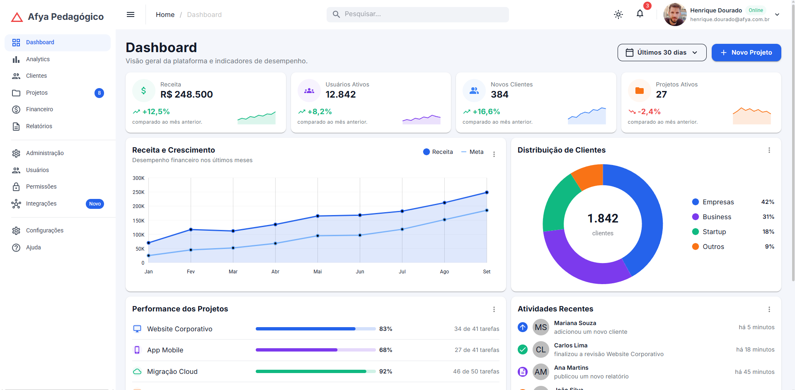
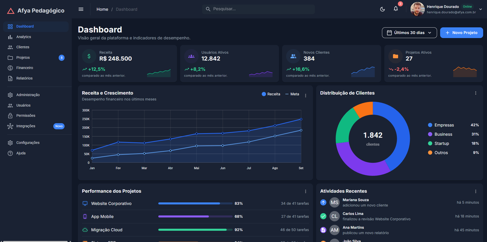
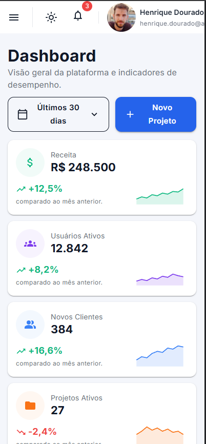
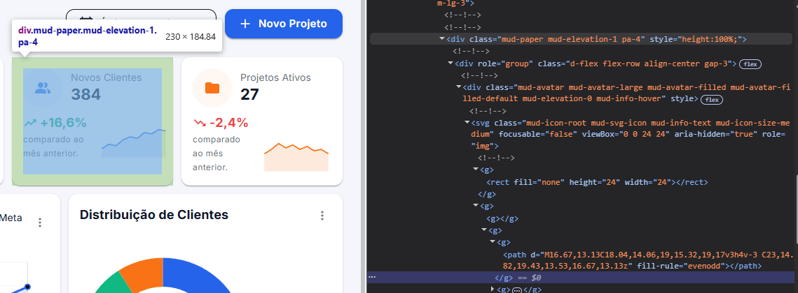
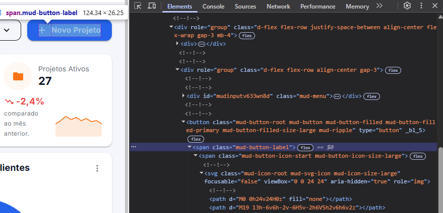

# Afya Admin — Dashboard com Blazor WebAssembly e MudBlazor

## Identificação

| | |
|---|---|
| **Aluno(a)** | Guilherme Soares da Silva |
| **Matrícula** | 000000 |
| **Faculdade** | Afya |
| **Curso** | Ciência da Computação |
| **Disciplina** | Programação de Sistemas Web |
| **Professor(a)** | Liluyoud Cury de Lacerda |
| **Semestre** | 2026.2 |

## Objetivo do projeto

O objetivo deste projeto foi entender como o Blazor e o MudBlazor organizam uma página, trabalhando com componentes, dados e pequenas alterações no visual.

O painel tem indicadores, gráficos, atividades e uma tabela com dados fictícios. O visual usa o tema e os componentes do MudBlazor; o projeto também mantém o CSS de carregamento e erro do template.

## Tecnologias utilizadas

- .NET 10 (SDK 10.0.401) / Blazor WebAssembly standalone
- MudBlazor 9.11.0
- Microsoft.AspNetCore.Components.WebAssembly 10.0.11
- Microsoft.AspNetCore.Components.WebAssembly.DevServer 10.0.11 (apenas em desenvolvimento)
- Fontes Inter e Roboto via Google Fonts

## Como executar

Requer o **.NET SDK 10**. Verifique com `dotnet --version`: a saída deve começar com `10.`. Se não estiver instalado, use `winget install Microsoft.DotNet.SDK.10` ou baixe em https://dotnet.microsoft.com/download/dotnet/10.0.

```bash
git clone https://github.com/guisosi/afya-admin.git
cd afya-admin
dotnet watch
```

A URL aparece no terminal (http://127.0.0.1:5070, definida em `Properties/launchSettings.json`). `Ctrl+C` encerra e `Ctrl+R` força o reinício. A primeira execução baixa os pacotes do NuGet e requer internet.

Para apenas compilar e ver os erros:

```bash
dotnet build
```

## Telas

### Tema claro


### Tema escuro


### Versão mobile


### HTML gerado (DevTools)



Inspecionei o card **Novos Clientes**. O `MudPaper` gera uma `<div>` com as classes `mud-paper`, `mud-elevation-1` e `pa-4`, responsáveis pelo card, pela sombra e pelo espaçamento interno. O `MudStack` também gera uma `<div>`, com `d-flex`, `flex-row` e `align-center` para organizar os elementos. A classe `pa-4` usada no Razor aparece no HTML final.



No botão **Novo Projeto**, o `MudButton` vira um `<button>`, com `<span>` para o texto e `<svg>` para o ícone. As classes `mud-button-filled`, `mud-button-filled-primary` e `mud-button-filled-size-large` aplicam o estilo preenchido, a cor e o tamanho definidos no Razor.

## Estrutura do projeto

```
afya-admin/
├── Components/          componentes de apresentação, sem rota
│   ├── AtividadesRecentes.razor
│   ├── CabecalhoPagina.razor
│   ├── DashboardCard.razor
│   ├── GraficoDistribuicaoClientes.razor
│   ├── GraficoReceita.razor
│   ├── KpiCard.razor
│   ├── PerformanceProjetos.razor
│   ├── ProjetosRecentes.razor
│   ├── SeletorPeriodo.razor
│   └── Ui.cs
├── Data/
│   └── DashboardData.cs
├── Layout/
│   ├── MainLayout.razor
│   └── NavMenu.razor
├── Pages/
│   ├── Dashboard.razor
│   └── NotFound.razor
├── Properties/
│   └── launchSettings.json
├── wwwroot/
│   ├── css/app.css
│   ├── img/
│   ├── favicon.png
│   └── index.html
├── App.razor
├── Program.cs
├── _Imports.razor
└── afya-admin.csproj
```

| Pasta | Papel |
|---|---|
| `Components` | componentes sem rota, reutilizados pelas páginas; recebem tudo por parâmetro |
| `Data` | os dados fictícios e os modelos (`record`) que os descrevem |
| `Layout` | a moldura fixa (AppBar, drawer, tema) que envolve todas as páginas |
| `Pages` | componentes com `@page`, que respondem por uma URL |
| `wwwroot` | arquivos servidos como estão ao navegador: `index.html`, CSS do template, imagens |

## Componentes usados

| Componente | Responsabilidade | Parâmetros que recebe |
|---|---|---|
| `DashboardCard` | card base: título, subtítulo opcional, slot de ações, menu "⋮" e conteúdo | `Titulo`, `Subtitulo`, `Acoes`, `Menu`, `ChildContent` |
| `CabecalhoPagina` | título e subtítulo da página, com as ações alinhadas à direita | `Titulo`, `Subtitulo`, `Acoes` |
| `SeletorPeriodo` | menu com aparência de botão para escolher o período | `Opcoes`, `Valor`, `ValorChanged` |
| `KpiCard` | indicador com ícone, valor, variação e sparkline | `Kpi` |
| `GraficoReceita` | gráfico de linha comparando receita e meta | `Meses`, `Receita`, `Meta` |
| `GraficoDistribuicaoClientes` | gráfico de rosca com o total no centro e legenda própria | `Total`, `Segmentos` |
| `PerformanceProjetos` | lista de projetos com barra de progresso e contagem de tarefas | `Projetos` |
| `AtividadesRecentes` | feed de atividades com avatar de ícone e de iniciais | `Atividades` |
| `ProjetosRecentes` | tabela de projetos com status, progresso e menu de ações | `Projetos` |
| `Ui` (classe estática) | funções auxiliares `FundoSuave(Color)` e `Iniciais(string)` | — |

## O que aprendi

1. **Como uma aplicação Blazor WebAssembly inicia no navegador? Qual é o papel do `index.html`, da `<div id="app">` e do `Program.cs`?**

   Entendi que o `index.html` é a página inicial e a `<div id="app">` é onde a aplicação aparece. O script do Blazor carrega o runtime .NET, e o `Program.cs` configura os serviços e inicia a aplicação nesse espaço.

2. **Qual é a diferença entre um Layout, uma Page e um Component neste projeto? Dê um exemplo de cada.**

   O Layout é a estrutura comum da tela, como o `MainLayout.razor`. A Page tem uma rota, como o `Dashboard.razor`. Já o Component é uma parte reutilizável, como o `KpiCard.razor`, que mostra um indicador.

3. **O que é um `RenderFragment` e como o `DashboardCard` usa esse recurso para ser reutilizado por vários cards?**

   Entendi que é um trecho de conteúdo passado para um componente. No `DashboardCard`, isso permite usar a mesma estrutura de card com conteúdos diferentes, como um gráfico ou uma tabela, pelos parâmetros `Acoes`, `Menu` e `ChildContent`.

4. **Como funciona o `@bind-Valor` no `SeletorPeriodo`? Qual é o papel do `ValorChanged`?**

   O `@bind-Valor` liga a seleção à variável `_periodo`. Ao escolher uma opção, o `ValorChanged` avisa a página para atualizar esse valor. Nesta versão, isso só muda o texto do botão; os dados continuam iguais.

5. **Por que os dados ficam na pasta `Data`, separados dos componentes? Que vantagem isso traz se, no futuro, os dados vierem de uma API?**

   Os dados ficam em `Data` e os componentes cuidam de mostrar as informações. Assim, fica mais fácil trocar os dados fictícios por dados de uma API sem refazer o visual.

6. **Como o `MudGrid` com `xs`, `sm` e `lg` faz os cards de KPI se reorganizarem em telas de tamanhos diferentes?**

   O grid tem 12 colunas. Com `xs="12"`, fica um card por linha; a partir de `sm="6"`, ficam dois; e a partir de `lg="3"`, ficam quatro.

7. **Como foi possível estilizar a página inteira sem escrever CSS? Explique o papel do tema (`MudTheme`) e das classes utilitárias.**

   O `MudTheme` define cores e fontes, e classes como `pa-4` e `mb-4` ajustam os espaços. O visual do dashboard usa esses recursos, embora o CSS do template continue no projeto.

8. **Por que o namespace do projeto é `afya_admin` e não `afya-admin`?**

   Porque o hífen não é permitido em nomes de C#: ele representa subtração. Por isso, o SDK transforma o nome do projeto em `afya_admin`, usando sublinhado no namespace.

## Dificuldades e soluções

1. **Linhas cortadas no PDF.** Alguns trechos vieram incompletos, com tags, aspas e parâmetros faltando. Completei essas partes nos arquivos para corrigir os erros de compilação. O mais confuso foi que nem sempre o erro apontava para a causa: em `PerformanceProjetos.razor`, uma tag `MudText` sem fechamento gerou vários erros em outras linhas.

2. **Imports faltando.** Faltavam `@using afya_admin.Components` e `@using afya_admin.Data` no `_Imports.razor`. Sem eles, os componentes não eram reconhecidos e o `@bind-Valor` também dava erro. Adicionar essas duas linhas resolveu os problemas relacionados.

3. **Cards que não apareciam.** O `KpiCard.razor` estava pronto, mas eu ainda não tinha colocado o `MudGrid` com o `@foreach` no `Dashboard.razor`. Como o projeto compilava normalmente, demorei mais para perceber que faltava usar o componente na página.

4. **Porta 5070 ocupada.** Uma execução anterior tinha deixado um processo aberto, impedindo o `dotnet watch` de iniciar. Localizei o PID com `netstat -ano | findstr :5070` e encerrei o processo que estava usando a porta.

## Melhorias futuras (opcional)

Quero começar fazendo a busca filtrar a tabela e criando as páginas dos outros menus. Depois, tentar fazer a troca de período alterar os dados e salvar a preferência de tema.
